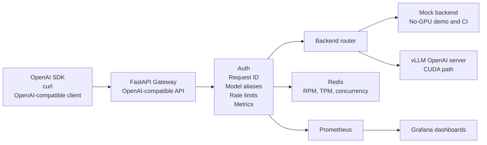

# OpenAI-Compatible LLM Serving Gateway

[](https://github.com/ictup/Mini_LLM_Serving_Platform/actions/workflows/ci.yml)


A production-style FastAPI gateway for OpenAI-compatible LLM serving. It sits
in front of mock or vLLM backends and adds the platform features that are
normally missing when a model server is exposed directly: API key auth, request
IDs, model aliases, Redis-backed RPM/TPM/concurrency limits, structured logs,
Prometheus metrics, Grafana dashboards, Docker Compose, Kubernetes, Helm, and
direct-backend vs Gateway benchmark reports.

This is a portfolio infrastructure project. It is intentionally scoped to show
how an LLM serving layer is designed, operated, benchmarked, and documented,
without claiming to be a full enterprise GPU scheduler.

## What This Demonstrates

- OpenAI-compatible `/v1/models` and `/v1/chat/completions` APIs.
- Streaming Server-Sent Events proxying with Time To First Token measurement.
- A backend abstraction that can route to a reproducible no-GPU mock backend or
  a real vLLM OpenAI-compatible server.
- Redis-backed per-key request rate limits, estimated token-per-minute limits,
  and concurrent request limits.
- Production-facing concerns around auth, request IDs, structured JSON logs,
  normalized errors, request size limits, readiness checks, and warmup.
- Prometheus and Grafana observability for Gateway behavior and vLLM engine
  metrics.
- Benchmark tooling for latency, TTFT, inter-token latency, throughput, error
  rate, and Gateway overhead.
- Deployment assets for Docker Compose, Kubernetes overlays, and Helm values.
- CI coverage for Python checks, tests, Helm lint, and Helm rendering.

## Architecture



The important design choice is the Gateway. vLLM handles model execution. The
Gateway owns the stable client contract and platform behavior around it.

## Verified State

| Area | Status |
| --- | --- |
| No-GPU local path | Verified with mock backend and SDK smoke test |
| GPU path | Verified locally with Docker Desktop and NVIDIA GPU |
| CI | Python lint, tests, Helm lint, Helm template rendering |
| Kubernetes | Base and GPU overlays render with Kustomize |
| Helm | Mock and vLLM modes render successfully |
| External RAG app wiring | Intentionally excluded from this completion |

GPU validation snapshot from May 19, 2026:

| Item | Value |
| --- | --- |
| GPU | NVIDIA GeForce RTX 4060 Laptop GPU, 8GB VRAM |
| vLLM image | `vllm/vllm-openai:v0.8.5.post1` |
| Served model | `Qwen/Qwen2.5-0.5B-Instruct` |
| Gateway alias | `qwen-small` |
| Result | Direct vLLM and Gateway streaming benchmarks completed with zero errors |

Full details are in
[docs/gateway_overhead_report.md](docs/gateway_overhead_report.md).

## Benchmark Snapshot

Portfolio profile on a local RTX 4060 Laptop GPU, using 100 measured streaming
requests per concurrency level:

| Concurrency | Direct RPS | Gateway RPS | Direct P95 Latency | Gateway P95 Latency | Gateway P50 TTFT |
| ---: | ---: | ---: | ---: | ---: | ---: |
| 1 | 1.73 | 1.85 | 1043.08 ms | 1047.83 ms | 42.54 ms |
| 4 | 5.71 | 5.38 | 1256.95 ms | 1278.05 ms | 54.69 ms |
| 8 | 9.45 | 9.08 | 1474.63 ms | 1551.73 ms | 57.66 ms |
| 16 | 13.58 | 12.56 | 2004.51 ms | 2232.31 ms | 77.95 ms |
| 32 | 17.87 | 15.94 | 3121.88 ms | 3567.71 ms | 124.27 ms |

The report generator compares direct backend calls against Gateway-routed calls
using the same prompt set, concurrency levels, stream mode, and token limits.
Both paths completed with zero errors. The Gateway-faster rows should be read
as local run variance and no obvious Gateway bottleneck, not as proof that the
Gateway accelerates vLLM.

## Quick Start: No GPU

The mock backend makes the platform reproducible on a laptop and in CI.

```bash
uv sync --frozen --all-groups
uv run python scripts/local_e2e.py
```

Run the quality gate:

```bash
uv run ruff check .
uv run pytest
```

Start the full local stack:

```bash
docker compose up --build
```

Local services:

| Service | URL |
| --- | --- |
| Gateway | http://localhost:8080 |
| Mock backend | http://localhost:9000 |
| Prometheus | http://localhost:9090 |
| Grafana | http://localhost:3000 |
| Redis | `localhost:6379` |

Grafana login defaults to `admin` / `admin`.

## Quick Start: GPU vLLM

Use the GPU override when Docker can access an NVIDIA runtime:

```powershell
$env:VLLM_MODEL="Qwen/Qwen2.5-0.5B-Instruct"
$env:VLLM_IMAGE_TAG="v0.8.5.post1"
docker compose -f docker-compose.yml -f docker-compose.gpu.yml up --build
```

Warm up the Gateway and run an OpenAI SDK smoke test:

```powershell
uv run python scripts/warmup_gateway.py --model qwen-small

$env:OPENAI_BASE_URL="http://localhost:8080/v1"
$env:OPENAI_API_KEY="dev-key"
$env:LLM_MODEL="qwen-small"
uv run python benchmark/client_smoke_test.py
```

The default GPU model is intentionally small because it has been validated on
an 8GB laptop GPU. Larger models can be selected by overriding `VLLM_MODEL` on
machines with enough free GPU memory.

## API Example

```bash
curl http://localhost:8080/v1/chat/completions \
  -H "Authorization: Bearer dev-key" \
  -H "Content-Type: application/json" \
  -d '{
    "model": "mock",
    "messages": [{"role": "user", "content": "Explain TTFT in one sentence."}],
    "stream": false
  }'
```

For streaming examples, model listing, error shapes, and health checks, see
[docs/api_usage.md](docs/api_usage.md).

## Run Direct vs Gateway Benchmarks

Run direct vLLM:

```bash
uv run python benchmark/run_benchmark.py \
  --profile portfolio \
  --base-url http://localhost:8000/v1 \
  --api-key local-vllm-key \
  --model Qwen/Qwen2.5-0.5B-Instruct \
  --prompts benchmark/prompts/short_prompts.jsonl \
  --timeout-seconds 120 \
  --stream true
```

Run through the Gateway:

For a serving-capacity benchmark, raise the local demo quota before starting
the Docker stack:

```powershell
$env:RATE_LIMIT_RPM="10000"
$env:RATE_LIMIT_TPM="2000000"
$env:RATE_LIMIT_CONCURRENT_REQUESTS="64"
docker compose -f docker-compose.yml -f docker-compose.gpu.yml up --build
```

```bash
uv run python benchmark/run_benchmark.py \
  --profile portfolio \
  --base-url http://localhost:8080/v1 \
  --api-key dev-key \
  --model qwen-small \
  --prompts benchmark/prompts/short_prompts.jsonl \
  --timeout-seconds 120 \
  --stream true
```

Generate the comparison report:

```bash
uv run python benchmark/compare_results.py \
  --direct-result benchmark/results/<direct-result>.json \
  --gateway-result benchmark/results/<gateway-result>.json \
  --prometheus-snapshot benchmark/results/<prometheus-snapshot>.json \
  --prometheus-timeseries benchmark/results/<prometheus-timeseries>.json \
  --output docs/gateway_overhead_report.md
```

The `portfolio` profile runs concurrency `1, 4, 8, 16, 32` with 100 measured
requests per level and 10 warmup requests. Use `--profile stress` for 1000
requests per level after the local GPU path is stable. See
[docs/performance_benchmarking.md](docs/performance_benchmarking.md).

## Deployment Paths

| Target | Entry point | Purpose |
| --- | --- | --- |
| Docker Compose, no GPU | `docker-compose.yml` | Reproducible local demo |
| Docker Compose, vLLM | `docker-compose.gpu.yml` | Local CUDA-backed serving |
| Kubernetes base | `deploy/k8s` | Gateway, mock backend, Redis, Prometheus |
| Kubernetes GPU overlay | `deploy/k8s-gpu` | Adds vLLM and vLLM metrics scraping |
| Helm | `deploy/helm` | Parameterized deployment skeleton |

Validate manifests:

```bash
kubectl kustomize deploy/k8s
kubectl kustomize deploy/k8s-gpu

helm lint deploy/helm
helm template mini-llm deploy/helm --namespace mini-llm-serving
helm template mini-llm deploy/helm \
  --namespace mini-llm-serving \
  --set vllm.enabled=true \
  --set mockBackend.enabled=false
```

## Repository Guide

| Path | Purpose |
| --- | --- |
| `gateway/app` | FastAPI Gateway, auth, rate limiting, proxying, metrics |
| `serving/mock_backend` | OpenAI-compatible mock backend |
| `benchmark` | SDK smoke tests, async benchmark runner, report tools |
| `monitoring` | Prometheus config and Grafana dashboards |
| `deploy/k8s` | No-GPU Kubernetes manifests |
| `deploy/k8s-gpu` | vLLM Kubernetes overlay |
| `deploy/helm` | Helm chart for mock and vLLM modes |
| `docs` | API, configuration, design decisions, operations, reports |

## Documentation

- [API usage](docs/api_usage.md)
- [Configuration matrix](docs/configuration.md)
- [Design decisions](docs/design_decisions.md)
- [Failure analysis](docs/failure_analysis.md)
- [Production hardening notes](docs/production_hardening.md)
- [Gateway overhead report](docs/gateway_overhead_report.md)
- [Performance benchmarking guide](docs/performance_benchmarking.md)
- [Project status and acceptance checklist](docs/project_status.md)
- [Portfolio summary](docs/portfolio_summary.md)
- [RAG integration guide](docs/rag_integration.md)
- [Recommended GitHub repository metadata](docs/repository_metadata.md)

## Design Boundaries

This repository is production-style, not a complete enterprise inference
platform. It does not implement multi-tenant billing, GPU cluster scheduling,
LoRA adapter routing, incident response, organization identity integration, or
full SLA/SLO management. Those are deliberately documented as boundaries so the
implemented platform remains focused and reproducible.
