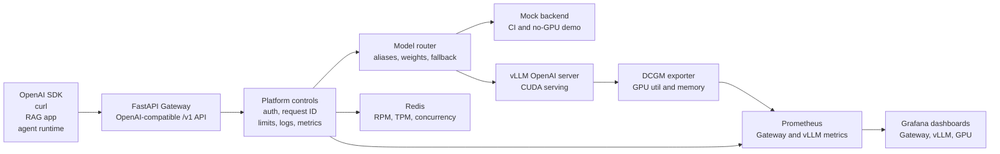

# OpenAI-Compatible LLM Serving Gateway

[](https://github.com/ictup/llm-serving-gateway-vllm/actions/workflows/ci.yml)
[](https://github.com/ictup/llm-serving-gateway-vllm/actions/workflows/security.yml)
[](https://github.com/ictup/llm-serving-gateway-vllm/actions/workflows/release.yml)
[](https://github.com/ictup/llm-serving-gateway-vllm/releases)
[](LICENSE)
[](pyproject.toml)
[](gateway/app/main.py)
[](docker-compose.gpu.yml)
[](deploy/helm)
[](monitoring)

Production-style FastAPI gateway for OpenAI-compatible LLM serving. It sits in
front of mock or vLLM backends and adds the platform layer that a raw model
server does not own: API keys, request IDs, model aliases, weighted routing,
Redis-backed RPM/TPM/concurrency limits, streaming metrics, Prometheus,
Grafana, GPU telemetry, Docker, Kubernetes, Helm, GitOps, Terraform,
supply-chain checks, release automation, and repeatable direct-vs-gateway
benchmarks.

This is a portfolio-grade AI infrastructure project. It is designed to show
how an LLM serving gateway is built, operated, benchmarked, secured, and
released without pretending to be a full enterprise GPU scheduler.

## Why This Project Exists

vLLM already exposes an OpenAI-compatible server. This project answers the
next platform question: what do you put around that server when teams need a
stable API contract, quotas, routing, metrics, deployment automation, and
release discipline?

The Gateway keeps those concerns outside model execution:

- Clients call one OpenAI-compatible `/v1` API.
- vLLM or the mock backend handles model responses.
- Redis enforces RPM, TPM, and concurrent request limits.
- Prometheus and Grafana expose request, streaming, vLLM, and GPU behavior.
- Docker, Kubernetes, Helm, Argo CD, and Terraform describe deployment paths.
- CI, security scans, SBOM/provenance, GHCR publishing, and SemVer releases
  make the repository behave like a maintained production project.

## Recruiter Snapshot

| Signal | Evidence |
| --- | --- |
| AI platform engineering | OpenAI-compatible Gateway, vLLM backend, streaming SSE, model routing, token-aware quotas |
| Production operations | Redis rate limits, readiness/warmup, structured logs, Prometheus metrics, Grafana dashboards, alert rules |
| Performance discipline | Direct-vs-Gateway benchmark runner, TTFT, ITL, TPOT, p95/p99, error-rate, tokenizer-level output token metrics |
| Deployment maturity | Docker Compose, K8s overlays, Helm chart, Argo CD examples, Terraform entry point |
| Delivery hygiene | CI, GHCR image publishing, Trivy/pip-audit, SBOM/provenance, Dependabot, SemVer release workflow |

In short: this is not only an inference demo. It shows benchmarking,
observability, and the platform scope recruiters expect:
GitOps, Terraform, supply-chain checks, release automation.

## Feature Overview

| Area | Implemented |
| --- | --- |
| API surface | `/v1/models`, `/v1/chat/completions`, OpenAI-compatible request/response schemas |
| Streaming | Server-Sent Events proxying with time-to-first-token measurement |
| Backends | No-GPU mock backend for CI and local demos, vLLM OpenAI server for CUDA serving |
| Routing | Model aliases, backend model mapping, weighted canary routes, fallback targets |
| Auth and safety | API key auth, request IDs, request body limits, chat message limits, normalized errors |
| Rate limiting | Redis-backed RPM, tokenizer-aware TPM, and concurrent request limits |
| Observability | Prometheus metrics, structured JSON logs, Grafana dashboards, alert rules |
| GPU telemetry | DCGM exporter wiring for GPU utilization and framebuffer memory |
| Benchmarking | Async direct-vLLM vs Gateway runs with RPS, latency, TTFT, ITL, TPOT, output tokens/sec, p95/p99, error rate |
| Deployment | Docker Compose, Kubernetes base and GPU overlays, Helm, Argo CD, Terraform skeleton |
| Supply chain | CI, Trivy, pip-audit, SBOM, provenance, Dependabot, GHCR image publishing |
| Release engineering | SemVer validation, changelog, release workflow, versioned GitHub Releases |

## Architecture



The important design choice is separation of concerns. vLLM executes the model;
the Gateway owns client-facing policy, routing, limits, observability, and the
operational contract.

## Quick Start: No GPU

The mock backend makes the platform reproducible on a laptop and in CI.

```bash
uv sync --frozen --all-groups
uv run python scripts/local_e2e.py
```

Run the quality gate:

```bash
uv run ruff check .
uv run pytest
```

Start the full no-GPU local stack:

```bash
docker compose up --build
```

| Service | URL |
| --- | --- |
| Gateway | http://localhost:8080 |
| Mock backend | http://localhost:9000 |
| Prometheus | http://localhost:9090 |
| Grafana | http://localhost:3000 |
| Redis | `localhost:6379` |

Grafana defaults to `admin` / `admin`.

## Quick Start: GPU vLLM

Use the GPU override when Docker can access an NVIDIA runtime:

```powershell
$env:VLLM_MODEL="Qwen/Qwen2.5-0.5B-Instruct"
$env:VLLM_IMAGE_TAG="v0.8.5.post1"
docker compose -f docker-compose.yml -f docker-compose.gpu.yml up --build
```

Warm up the Gateway and run an OpenAI SDK smoke test:

```powershell
uv run python scripts/warmup_gateway.py --model qwen-small

$env:OPENAI_BASE_URL="http://localhost:8080/v1"
$env:OPENAI_API_KEY="dev-key"
$env:LLM_MODEL="qwen-small"
uv run python benchmark/client_smoke_test.py
```

The default GPU model is intentionally small because it has been validated on
an 8GB RTX 4060 Laptop GPU. Larger models can be selected by overriding
`VLLM_MODEL` on machines with enough free GPU memory.

## API Example

```bash
curl http://localhost:8080/v1/chat/completions \
  -H "Authorization: Bearer dev-key" \
  -H "Content-Type: application/json" \
  -d '{
    "model": "mock",
    "messages": [
      {
        "role": "user",
        "content": "Explain TTFT in one sentence."
      }
    ],
    "stream": false
  }'
```

For streaming examples, model listing, error shapes, and health checks, see
[docs/api_usage.md](docs/api_usage.md).

## Benchmark Snapshot

Portfolio profile on a local RTX 4060 Laptop GPU with 100 measured streaming
requests per concurrency level:

| Concurrency | Direct RPS | Gateway RPS | Direct P95 Latency | Gateway P95 Latency | Gateway P50 TTFT |
| ---: | ---: | ---: | ---: | ---: | ---: |
| 1 | 1.73 | 1.98 | 1043.08 ms | 896.34 ms | 39.27 ms |
| 4 | 5.71 | 6.31 | 1256.95 ms | 1119.99 ms | 50.63 ms |
| 8 | 9.45 | 10.14 | 1474.63 ms | 1368.80 ms | 54.08 ms |
| 16 | 13.58 | 14.19 | 2004.51 ms | 1902.34 ms | 70.16 ms |
| 32 | 17.87 | 16.11 | 3121.88 ms | 3529.36 ms | 169.88 ms |

Both direct and Gateway paths completed with zero errors. Gateway-faster rows
should be read as local run variance and "no obvious Gateway bottleneck", not
as proof that the Gateway accelerates vLLM.

Full report:
[docs/gateway_overhead_report.md](docs/gateway_overhead_report.md)

## Run Direct vs Gateway Benchmarks

Run direct vLLM:

```bash
uv run python benchmark/run_benchmark.py \
  --profile portfolio \
  --base-url http://localhost:8000/v1 \
  --api-key local-vllm-key \
  --model Qwen/Qwen2.5-0.5B-Instruct \
  --prompts benchmark/prompts/short_prompts.jsonl \
  --output-tokenizer-path D:/models/qwen-tokenizer.json \
  --timeout-seconds 120 \
  --stream true
```

For Gateway serving-capacity runs, raise the demo quota before starting the
Docker stack:

```powershell
$env:RATE_LIMIT_RPM="10000"
$env:RATE_LIMIT_TPM="2000000"
$env:RATE_LIMIT_CONCURRENT_REQUESTS="64"
docker compose -f docker-compose.yml -f docker-compose.gpu.yml up --build
```

Run through the Gateway:

```bash
uv run python benchmark/run_benchmark.py \
  --profile portfolio \
  --base-url http://localhost:8080/v1 \
  --api-key dev-key \
  --model qwen-small \
  --prompts benchmark/prompts/short_prompts.jsonl \
  --output-tokenizer-path D:/models/qwen-tokenizer.json \
  --timeout-seconds 120 \
  --stream true
```

Generate the comparison report:

```bash
uv run python benchmark/compare_results.py \
  --direct-result benchmark/results/<direct-result>.json \
  --gateway-result benchmark/results/<gateway-result>.json \
  --prometheus-snapshot benchmark/results/<prometheus-snapshot>.json \
  --prometheus-timeseries benchmark/results/<prometheus-timeseries>.json \
  --output docs/gateway_overhead_report.md
```

The `portfolio` profile runs concurrency `1, 4, 8, 16, 32` with 100 measured
requests per level and 10 warmup requests. Supplying
`--output-tokenizer-path` adds tokenizer-level output tokens/sec and TPOT. Use
`--profile stress` for 1000 requests per level after the local GPU path is
stable.

See [docs/performance_benchmarking.md](docs/performance_benchmarking.md).

## Observability

The local and deployment assets expose three dashboard layers:

| Dashboard | What it shows |
| --- | --- |
| Gateway Overview | request rate, latency, errors, rejections, streaming TTFT, streaming duration |
| vLLM Engine Overview | running requests, waiting requests, KV cache pressure, prompt/generation tokens/sec |
| GPU Overview | DCGM GPU utilization and framebuffer memory usage |

Prometheus alert examples cover elevated Gateway error rate, p95 latency,
streaming TTFT, rejection rate, vLLM queued requests, and vLLM KV cache usage.

## Deployment Paths

| Target | Entry point | Purpose |
| --- | --- | --- |
| Docker Compose, no GPU | `docker-compose.yml` | Reproducible local demo |
| Docker Compose, vLLM | `docker-compose.gpu.yml` | Local CUDA-backed serving plus DCGM GPU metrics |
| Kubernetes base | `deploy/k8s` | Gateway, mock backend, Redis, Prometheus |
| Kubernetes GPU overlay | `deploy/k8s-gpu` | vLLM backend, vLLM metrics, DCGM scraping |
| Helm | `deploy/helm` | Parameterized mock or vLLM deployment |
| GitOps / Argo CD | `deploy/gitops` | Continuous sync examples for Helm releases |
| Terraform IaC | `deploy/terraform` | Namespace, Secret boundary, Argo CD Application entry point |

Validate manifests:

```bash
kubectl kustomize deploy/k8s
kubectl kustomize deploy/k8s-gpu

helm lint deploy/helm
helm template mini-llm deploy/helm --namespace mini-llm-serving
helm template mini-llm deploy/helm \
  --namespace mini-llm-serving \
  --set vllm.enabled=true \
  --set mockBackend.enabled=false \
  --set dcgmExporter.enabled=true
```

## Repository Guide

| Path | Purpose |
| --- | --- |
| `gateway/app` | FastAPI Gateway, auth, rate limiting, proxying, metrics |
| `serving/mock_backend` | OpenAI-compatible mock backend |
| `benchmark` | SDK smoke tests, async benchmark runner, report tools |
| `monitoring` | Prometheus config, alert rules, Grafana dashboards |
| `deploy/k8s` | No-GPU Kubernetes manifests |
| `deploy/k8s-gpu` | vLLM and DCGM Kubernetes overlay |
| `deploy/helm` | Helm chart for mock and vLLM modes |
| `deploy/gitops` | Argo CD Applications for mock and vLLM modes |
| `deploy/terraform` | Terraform root module for GitOps cluster entry points |
| `docs` | API, configuration, design decisions, operations, reports |

## Verified State

| Area | Status |
| --- | --- |
| No-GPU local path | Verified with mock backend and SDK smoke test |
| GPU path | Verified locally with Docker Desktop and NVIDIA GPU |
| CI | Python lint, tests, Helm lint, Helm template rendering |
| Kubernetes | Base and GPU overlays render with Kustomize |
| Helm | Mock and vLLM modes render successfully |
| Release | `v0.1.1` published with CI, security, release, and container workflows passing |
| External RAG app wiring | Intentionally excluded from this completion |

GPU validation snapshot from May 19, 2026:

| Item | Value |
| --- | --- |
| GPU | NVIDIA GeForce RTX 4060 Laptop GPU, 8GB VRAM |
| vLLM image | `vllm/vllm-openai:v0.8.5.post1` |
| Served model | `Qwen/Qwen2.5-0.5B-Instruct` |
| Gateway alias | `qwen-small` |
| Result | Direct vLLM and Gateway streaming benchmarks completed with zero errors |

## Documentation

- [API usage](docs/api_usage.md)
- [Configuration matrix](docs/configuration.md)
- [Design decisions](docs/design_decisions.md)
- [Failure analysis](docs/failure_analysis.md)
- [Production hardening notes](docs/production_hardening.md)
- [GitOps deployment guide](docs/gitops_deployment.md)
- [Terraform IaC guide](deploy/terraform/README.md)
- [Security and supply chain](docs/security.md)
- [Release process](docs/release_process.md)
- [Gateway overhead report](docs/gateway_overhead_report.md)
- [Performance benchmarking guide](docs/performance_benchmarking.md)
- [Project status and acceptance checklist](docs/project_status.md)
- [Portfolio summary](docs/portfolio_summary.md)
- [RAG integration guide](docs/rag_integration.md)
- [Recommended GitHub repository metadata](docs/repository_metadata.md)

## License

This project is released under the [MIT License](LICENSE).

## Suggested Repository Metadata

Recommended repository name:

```text
llm-serving-gateway-vllm
```

Recommended About description:

```text
OpenAI-compatible LLM serving gateway with vLLM, FastAPI, Redis quotas, Prometheus/Grafana, GPU metrics, benchmarks, Docker, Kubernetes, Helm, GitOps, Terraform, and CI/CD.
```

Recommended topics:

```text
llm, llmops, llm-gateway, ai-gateway, model-serving, openai-compatible,
openai-proxy, vllm, fastapi, redis, prometheus, grafana, docker,
kubernetes, helm, argocd, terraform, gitops, benchmarking,
ai-infrastructure
```

See [docs/repository_metadata.md](docs/repository_metadata.md) for GitHub UI
and GitHub CLI setup notes.

## Design Boundaries

This repository is production-style, not a complete enterprise inference
platform. It does not implement multi-tenant billing, GPU cluster scheduling,
LoRA adapter routing, incident response, organization identity integration, or
full SLA/SLO management. Those are documented boundaries so the implemented
platform remains focused, verifiable, and reproducible.
