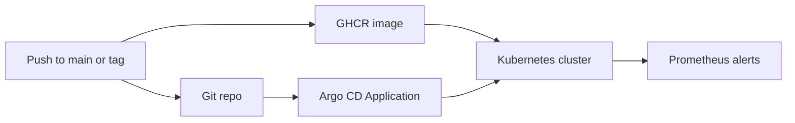

# GitOps Deployment Guide

This guide shows how the Helm chart can be operated through Argo CD instead of
manual `helm upgrade --install` commands.

## What Is Included

| Artifact | Purpose |
| --- | --- |
| `.github/workflows/container.yml` | Builds `Dockerfile.gateway` and publishes the Gateway/mock image to GHCR. |
| `deploy/gitops/argocd-application-mock.yaml` | Argo CD Application for the no-GPU mock backend stack. |
| `deploy/gitops/argocd-application-vllm.yaml` | Argo CD Application for the vLLM GPU stack. |
| `deploy/terraform` | Optional Terraform root module for managing the Argo CD Application and namespace. |
| `deploy/helm` | Shared chart used by both Applications. |

## Flow



## Secret Model

The GitOps manifests reference pre-existing Kubernetes Secrets:

- `gateway-secret`: `API_KEYS` and, in vLLM mode, `VLLM_API_KEY`.
- `vllm-secret`: `VLLM_API_KEY` and optional `HUGGING_FACE_HUB_TOKEN`.

Create those Secrets manually for a lab cluster or through External Secrets in a
shared environment. The example External Secrets manifest lives at
`deploy/k8s/examples/external-secrets.yaml`.

Terraform users can manage the namespace and Argo CD Application from
`deploy/terraform` while still keeping real secret values outside Git.

## Mock Stack

Use the mock stack to validate Argo CD sync, Gateway readiness, Redis,
Prometheus, and alert rule loading without requiring a GPU:

```bash
kubectl apply -f deploy/gitops/argocd-application-mock.yaml
argocd app sync mini-llm-serving-mock
argocd app wait mini-llm-serving-mock --health
```

## vLLM GPU Stack

Use the vLLM stack when the target cluster has GPU nodes and the NVIDIA device
plugin installed:

```bash
kubectl apply -f deploy/gitops/argocd-application-vllm.yaml
argocd app sync mini-llm-serving-vllm
argocd app wait mini-llm-serving-vllm --health
```

The default model is `Qwen/Qwen2.5-0.5B-Instruct`, matching the locally
validated Docker GPU path.

## Validation

After sync, validate the user-facing API:

```bash
kubectl -n mini-llm-serving port-forward svc/gateway 8080:8080
uv run python scripts/warmup_gateway.py --model qwen-small
uv run python benchmark/client_smoke_test.py
```

Validate Prometheus alert rules:

```bash
kubectl -n mini-llm-serving port-forward svc/prometheus 9090:9090
curl http://localhost:9090/api/v1/rules
```

## Production Notes

- Replace the GHCR image with your registry if the package is private or moved.
- Pin immutable image tags for release environments instead of tracking `main`.
- Use `deploy/terraform` when cluster entry points should be managed by IaC
  instead of one-off `kubectl apply` commands.
- Keep Argo CD automated prune/self-heal enabled only for namespaces where this
  repository is the source of truth.
- Use External Secrets or a managed secret provider for shared clusters.
- Add Alertmanager receiver routing outside this repository to connect alerts to
  Slack, email, PagerDuty, or a cloud-native incident tool.
